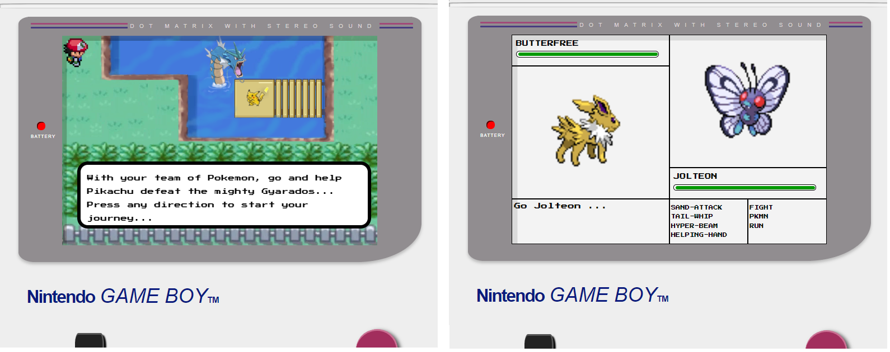

# Gameboy Nostalgia
A nostalgic Pokemon game built in vanilla javascript. The game is built to resemble the style of the original Gameboy version with an "open world" stage, where a sprite is controlled on-screen to navigate through an enemy-filled terrain and a battle mode, where the player can choose from their team of Pokemon and select from a set of attack moves to defeat their opponents. 

Live Demo: https://gameboy-classic.herokuapp.com/

## How I built this:
* Being my first project of relative complexity, I chose to focus entirely on vanilla Javascript. The game was a favourite of mine as a child so I had a good understanding of how the end project should turn out. I built the two modes of the game - the "open-world" and battle mode - as separate components which would be rendered to the screen based on which state the player is currently in.
* I used an open source Pokemon API for information and statistics of the Pokemon characters, as well as images. I then built a dynamic damage system which is analogous to the original damage system in the Nintendo games; which calculates damage based on the type of attack, the Pokemon type and the corresponding attack and defence attributes of both the attacking and defending Pokemon.  

## What I learnt:
* I gained a good understanding of how HTML Canvas works in order to animate sprites and build the "open-world" aspects of the game.
* To achieve the signature spiralling black screen which precedes a battle in Pokemon, I had to understand and implement recursive functions.
* I gained  animations work in CSS as well as event timings using Async/Await.
* I used CSS variables in order to dynamically change the colour of damage bars which were dependent on the level of damage inflicted.
* This was my first time experiencing and appreciating the advantages of CSS grid, given the structured layout of the battle mode in Pokemon.

## What I would do differently if I were to do it again:
* The data used to underpin the battle mode is reliant on the design of the external API. Any changes to how the API is structured could therefore create breaking issues in various parts of the application. I would redesign the way the data is brought in so that there is an interface between the API and my application. That way, changes to the API would only need to be made in one program at the root of the application.
* As I have no control over the external API, I would also have a back-up of a minimal set of data so that the game can still be played, albeit limited to a smaller selection of Pokemon and attack move, if the API were to go offline for any reason.
* The canvas elements of the grid and lack of on screen controls make it so the game is not mobile-friendly so changes to the responsive design elements and the controls would need to be made.
* It also was not optimised for all browsers as it was built with various es6 features so would be useful to use a build tool to transpile es6 features for older browsers.
* There would be massive advantages for using a front-end library/framework for this application. The need for multiple getElementByID commands would be removed by using a state-based front-end using React for example. This would make the code much more readable and easier to edit.
* Everything is currently declared in the global scope so it would be of great benefit to use modules to avoid namespace pollution and make the code more re-usable.
